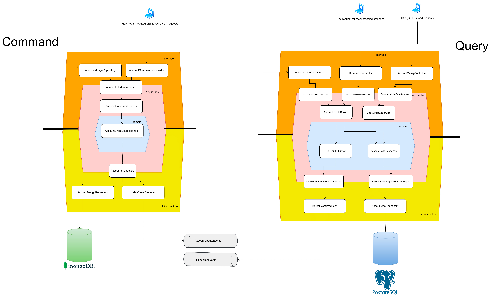

# SpringBoot CQRS With event sourcing Example
Exmaple of cqrs and event sourcing simplified. 

No mediator patterns are used to simplified the explanation

No test included, this project is just for learning

The Architecture is the following:

## Future Improvements

In event sourcing due to maybe an Aggregate may have thousands of events, is not a good idea to reconstruct it always 
usisng all of them

A future improvemnt would be to implement a snapshots mechanism to rebuild the object from the last snapshot specifing 
the version and then the next events versions
